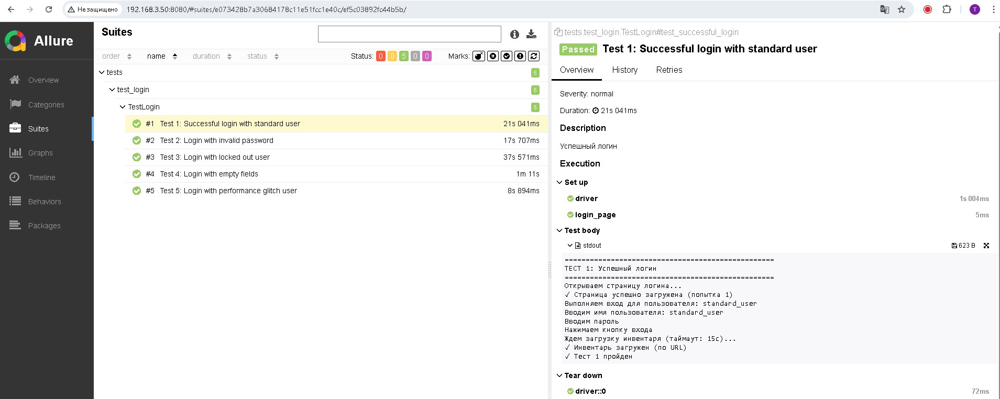
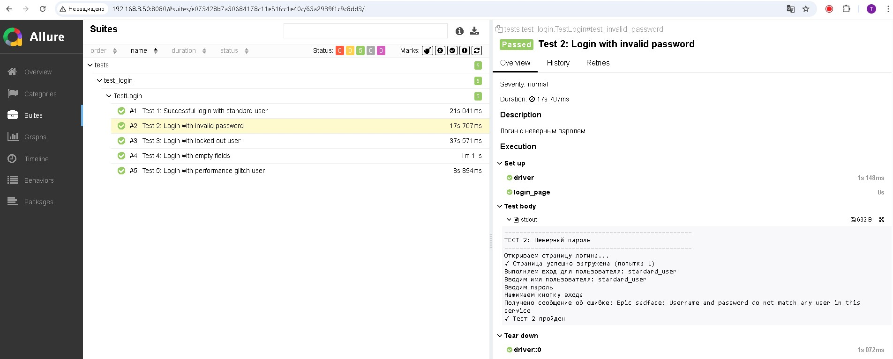
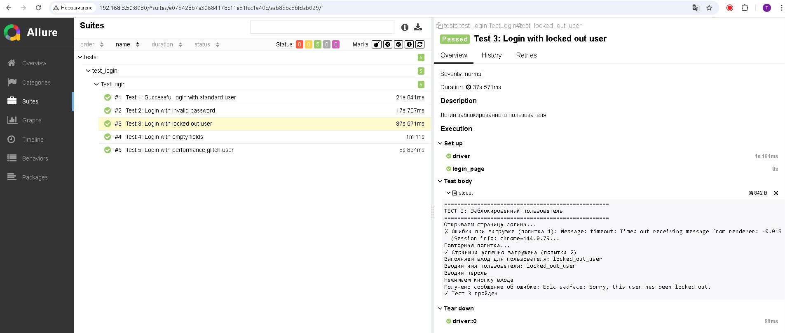
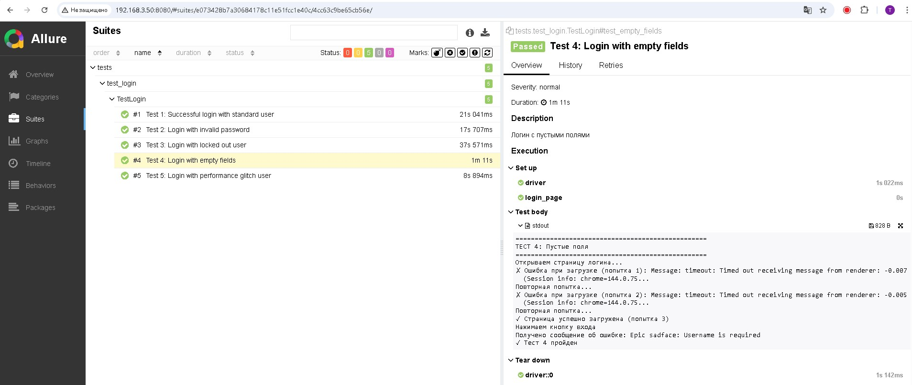
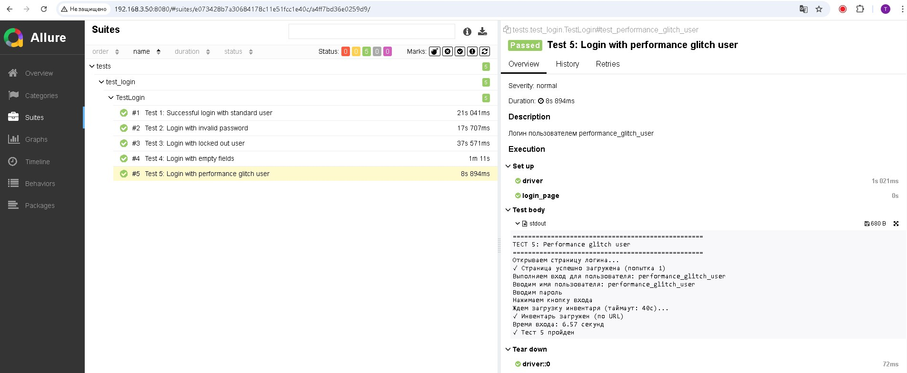

# 🧪 Swag Labs Automated Tests

## 📋 Описание проекта
Автоматизированные тесты для сайта [Swag Labs](https://www.saucedemo.com/). Проект включает 5 тестовых сценариев авторизации с использованием Python, Selenium и Allure для отчетов.

## ✅ Тестовые сценарии
1. **Успешный логин** (standard_user / secret_sauce)
2. **Логин с неверным паролем**
3. **Логин заблокированного пользователя** (locked_out_user)
4. **Логин с пустыми полями**
5. **Логин пользователем performance_glitch_user** (проверка работы с задержками)

## 🛠️ Настройка окружения (Ubuntu/Debian)

### 1. Установка Python 3.10
```bash
# Обновление системы
sudo apt update

# Установка Python 3.10 и необходимых пакетов
sudo apt install python3.10 python3.10-venv python3.10-dev

# Проверка версии Python
python3.10 --version
```

### 2. Создание виртуального окружения
```bash
# Создание виртуального окружения
python3.10 -m venv venv

# Активация виртуального окружения
source venv/bin/activate

# Проверка что окружение активировано (должно быть (venv) в начале строки)
python --version

# Обновление pip
pip install --upgrade pip
```

### 3. Установка Google Chrome (для локального запуска)
```bash
# Выйдите из виртуального окружения для установки системных пакетов
deactivate

# Установка Chrome
sudo apt install -y wget gnupg
wget -q -O - https://dl-ssl.google.com/linux/linux_signing_key.pub | sudo apt-key add -
sudo sh -c 'echo "deb [arch=amd64] http://dl.google.com/linux/chrome/deb/ stable main" >> /etc/apt/sources.list.d/google-chrome.list'
sudo apt update
sudo apt install -y google-chrome-stable

# Проверка установки
google-chrome-stable --version

# Вернитесь в виртуальное окружение
source venv/bin/activate
```

## 🚀 Установка проекта

### 1. Клонирование и настройка
```bash
# Клонирование репозитория
git clone <repository-url>
cd test_saucedemo_com

# Активация виртуального окружения
source venv/bin/activate

# Установка зависимостей Python
pip install -r requirements.txt
```

### 2. Очистка кэша драйверов (если были проблемы)
```bash
# Очистка кэша webdriver-manager
rm -rf ~/.wdm/drivers/chromedriver/
pip install --upgrade webdriver-manager
```

## 🧪 Запуск тестов

### 1. Локальный запуск
```bash
# Локальный запуск
pytest tests/ -v

# Запуск только smoke тестов
pytest tests/ -m smoke -v

# Запуск performance тестов
pytest tests/ -m performance -v
```

### 2. Запуск с генерацией Allure отчетов
```bash
# Запуск тестов с сохранением результатов
pytest tests/ -v --alluredir=./allure-results

# Установка Allure (требуется только один раз)
sudo apt update
sudo apt install default-jre
wget https://github.com/allure-framework/allure2/releases/download/2.24.0/allure-2.24.0.tgz
tar -zxvf allure-2.24.0.tgz
sudo mv allure-2.24.0 /opt/allure
echo 'export PATH=$PATH:/opt/allure/bin' >> ~/.bashrc
source ~/.bashrc

# Просмотр отчета
allure serve ./allure-results
```

### 3. Альтернативный способ просмотра отчетов (для удаленных серверов)
```bash
# Генерация статического отчета
allure generate ./allure-results -o ./allure-report --clean

# Запуск веб-сервера для просмотра отчета
cd allure-report
python3 -m http.server 8080 --bind 0.0.0.0

# Откройте в браузере: http://IP_СЕРВЕРА:8080
```

## 🐳 Запуск в Docker (рекомендуется)

### 1. Сборка и запуск
```bash
# Сборка Docker образа
docker-compose build

# Запуск тестов
docker-compose up
```

### 2. Прямой запуск через Docker (без docker-compose)
```bash
# Сборка образа
docker build -t swag-labs-tests .

# Запуск тестов
docker run --rm swag-labs-tests
```

## ⚠️ Известные проблемы и решения

### Ошибка docker-compose после успешного выполнения тестов

Exception in thread Thread-4 (watch_events):
Traceback (most recent call last):
...
KeyError: 'id'

**Решение:** Эту ошибку можно игнорировать. Она не влияет на выполнение тестов (все тесты выполняются успешно, exit code 0).

## 📊 Требования технического задания - выполнены:

### ✅ Основные требования:
- [x] 5 тестовых сценариев авторизации
- [x] Использование Selenium
- [x] Page Object паттерн
- [x] Подключение Allure
- [x] Проверка корректности URL и элементов
- [x] Dockerfile для запуска в контейнере
- [x] Python 3.10
- [x] Все зависимости в requirements.txt
- [x] Инструкция по запуску в README.md

### ✅ Дополнительно реализовано:
- [x] Кэширование драйвера для ускорения тестов
- [x] Скриншоты при падении тестов
- [x] Makefile для упрощения команд
- [x] Работа в Docker контейнере
- [x] Генерация HTML отчетов
- [x] Обработка различных ошибок

## 🎯 Результаты выполнения
- **Все 5 тестов проходят успешно**
- **Локальный запуск**: 5-10 секунд
- **Docker запуск**: 1-2 минуты
- **Отчеты**: Allure + HTML
- **Кросс-платформенность**: Linux, Docker

## 📸 Скриншоты выполнения тестов

### 1. Успешный логин


### 2. Логин с неверным паролем  


### 3. Логин заблокированного пользователя


### 4. Логин с пустыми полями


### 5. Логин performance_glitch_user


## 📞 Поддержка
При возникновении проблем:
1. Очистите кэш драйверов: `rm -rf ~/.wdm/`
2. Переустановите зависимости: `pip install -r requirements.txt`
3. Используйте Docker: `make docker-test`
4. Проверьте что Chrome установлен: `google-chrome-stable --version`

---
**Проект готов к использованию в CI/CD, соответствует всем требованиям технического задания.**